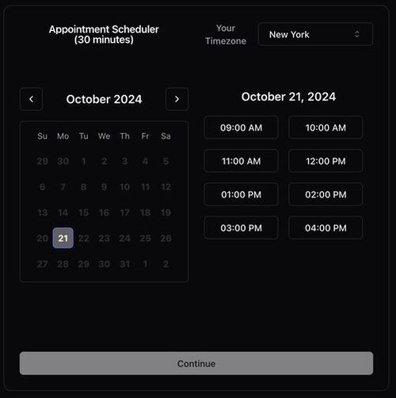
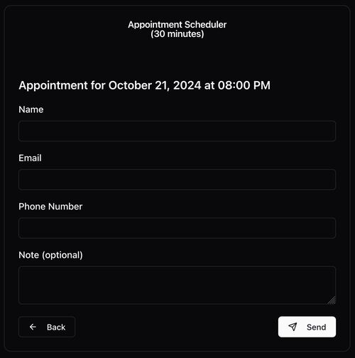

# Someday

**Free and open-source cal.com / calendly alternative built on [Google-Apps-Script](https://developers.google.com/apps-script) for Gmail users.**



## Demo

[https://someday-demo.vercel.app/](https://someday-demo.vercel.app/)

## What is Someday?

Someday is a simple, open-source scheduling tool designed specifically for Gmail users. Uses Google Apps Scripts to host and [clasp](https://github.com/google/clasp) to manage. Built with modern technologies like [React](https://react.dev/), [TypeScript](https://www.typescriptlang.org/), [Shadcn/UI](https://ui.shadcn.com/), and [Vite](https://vite.dev/). A simple alternative to traditional scheduling apps like Calendly.

### Key Features

- **Free and Open Source**: Enjoy all the premium scheduling features without any cost. Someday is completely free to use and open for contributions.
- **Effortless Integration**: Designed as a Google App Script, Someday integrates seamlessly with your Gmail, making it easy to manage your schedule directly from your inbox.
- **Developer-Friendly**: Built with modern, developer-preferred technologies, Someday is easy to customize and extend to meet your specific needs.
- **Customizable Work Hours**: Set your availability with precision, allowing others to book time slots that fit your schedule perfectly.
- **Simple Booking Process**: Users can select a date and time slot, then fill out a straightforward form with their name, email, phone, and an optional note.
- **Privacy First**: No data sharing beyond google to 3rd party apps

## Getting Started

### Customize 

Change the following variables in `backend/src/app.ts` to customize your availability settings:

```typescript
// backend/src/app.ts
const CALENDAR = "primary";
const TIME_ZONE = "America/New_York";
const WORKDAYS = [1, 2, 3, 4, 5];
const WORKHOURS = {
  start: 9,
  end: 13,
};
const TIMESLOT_DURATION = 30;
```

### Develop

- `cd ./frontend`
- `npm install`
- `npm run dev`
- update `dummyData` by running `./dummydata.sh`

### Install 


### Step 1: Set Up Your Environment

__you may need to sign out of all accounts, and only into your target account__

1. **Install `clasp`:**
   - Ensure you have Node.js installed.
   - Install `clasp` globally using npm:
     ```bash
     npm install -g @google/clasp
     ```

2. **Login with `clasp`:**
   - Execute the following command to log in:
     ```bash
     clasp login
     ```

3. **Remove Existing Configuration (if necessary):**
   - If you encounter issues, remove the existing `.clasp.json` file:
     ```bash
     rm .clasp.json
     ```


4. **Enable Apps Script API:**
   - Visit [Google Apps Script API settings](https://script.google.com/home/usersettings).
   - Enable the Apps Script API.
   - Wait a few minutes for the changes to propagate.

### Step 2: Create and Deploy the Script

1. **Create a New Project:**
   - Create a new Apps Script project as a web app:
     ```bash
     clasp create --type webapp
     ```

2. **Deploy the Script:**
   - Use the following command to deploy your script:
     ```bash
     npm run deploy
     ```


3. **Access the Web App:**
   - Visit the URL provided after deployment.
   - You will see the message "Authorization is required to perform that action."
  
4. **Authorize the Web App: (!!! IMPORTANT !!!)**
   - run `clasp open` to open the editor
   - go to `dist/app.gs`
   - in the drop down at the top, select `fetchAvailability` then hit run
   - Authorization modal will pop up, 'Review permissions', select your account, you will see a warning, go to advanced, then Go to <your script>(unsafe) then click Allow
   - if it worked, refresh the page/editor then run the function again and it should complete without issue.

## Cheat Sheet

- `npm run deploy` - build and delpoy

- `npm run build` - build only, follow with `clasp push` to push changes

- `undeployall.sh` - undeploy all versions of the script

- `deployments.sh` - list all deployments web-urls

- `clasp open` - open the script editor

## Screen Captures




## Contributing

Open a pull request or issue to contribute to Someday. welcoming all contributions, including bug fixes, feature requests, and documentation improvements.

## License

MIT
